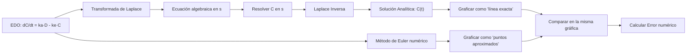

# BioTracker — Plan de Implementación

Aplicación web con Streamlit que modela la farmacocinética de **Cafeína** y **Creatina** usando ecuaciones diferenciales, resueltas tanto analíticamente (Transformada de Laplace) como numéricamente (Método de Euler). El proyecto es para la materia "Matemáticas para la Ingeniería II" (8° semestre IDGS).

## Contexto del Equipo

- **2 personas, 5 días** (22–26 de abril 2026)
- **Persona A (Brian)**: Desarrollo principal del código
- **Persona B (Compañero)**: Documentación, testing, apoyo en código
- **Código base existente**: [app.py](file:///home/brian/Documentos/Universidad/8A_IDGS/Matematicas_para_la_ingenieriaII/Metodos%20numericos/app.py) con Euler, SymPy, Streamlit y fix Python 3.14
- **Entregables**: Reporte técnico (digital), producto funcional, presentación oral 15-20 min

---

## Integración REAL de Laplace — Cómo encaja

> [!IMPORTANT]
> Laplace no es decoración. Es el **método de resolución analítica** que produce la solución exacta contra la cual se compara Euler.

### Flujo completo en la app:



### Para Cafeína (modelo agudo):

**Paso 1** — SymPy define la EDO simbólica:
```python
C = sp.Function('C')
t, s = sp.symbols('t s', positive=True)
ka, ke, D0 = sp.symbols('k_a k_e D_0', positive=True)

# EDO: dC/dt = ka * D0 * exp(-ka*t) - ke * C(t)
ode = sp.Eq(C(t).diff(t), ka * D0 * sp.exp(-ka*t) - ke * C(t))
```

**Paso 2** — Aplicar Laplace Transform con SymPy:
```python
# SymPy puede resolver la ODE directamente via dsolve (que internamente usa Laplace)
solucion = sp.dsolve(ode, C(t), ics={C(0): 0})
# Resultado: C(t) = ka*D0/(ka - ke) * (exp(-ke*t) - exp(-ka*t))  ← Ecuación de Bateman
```

**Paso 3** — Mostrar en la app con `st.latex()` el proceso paso a paso:
- La EDO original
- La transformada en el dominio de s
- La solución algebraica
- La inversa → resultado final

**Paso 4** — Comparar con Euler en la gráfica.

### Para Creatina (modelo crónico):
```python
# EDO: dS/dt = I - k*S(t)
# Solución vía Laplace: S(t) = I/k * (1 - exp(-k*t)) + S0*exp(-k*t)
```

---

## Arquitectura del Proyecto

```
Proyecto_Final/
├── app.py                  # Punto de entrada principal de Streamlit
├── run.py                  # Launcher con fix Python 3.14
├── requirements.txt        # Dependencias
├── README.md               # Instrucciones de instalación y uso
│
├── models/                 # Lógica matemática (backend)
│   ├── __init__.py
│   ├── caffeine.py         # Modelo farmacocinético de cafeína
│   ├── creatine.py         # Modelo de saturación de creatina
│   └── solvers.py          # Método de Euler genérico + utilidades
│
├── views/                  # Páginas de Streamlit (frontend)
│   ├── __init__.py
│   ├── home.py             # Página de bienvenida
│   ├── caffeine_view.py    # UI del módulo de cafeína
│   └── creatine_view.py    # UI del módulo de creatina
│
└── assets/                 # Recursos estáticos
    └── logo.png            # Logo de BioTracker (opcional)
```

> [!NOTE]
> Separar `models/` y `views/` es clave: permite que Persona B haga testing de los modelos matemáticos sin tocar la UI, y que Brian modifique la UI sin romper las ecuaciones.

---

## Cambios Propuestos

### Componente 1: Motor Matemático (`models/`)

---

#### [NEW] [solvers.py](file:///home/brian/Documentos/Universidad/8A_IDGS/Matematicas_para_la_ingenieriaII/Proyecto_Final/models/solvers.py)

Método de Euler genérico reutilizable para ambos modelos:
- `euler_method(f, y0, t_span, dt)` → retorna arrays de `t` y `y`
- Adaptado del [Euler existente](file:///home/brian/Documentos/Universidad/8A_IDGS/Matematicas_para_la_ingenieriaII/Metodos%20numericos/app.py#L43-L50) pero generalizado para recibir solo `f(t, y)`

#### [NEW] [caffeine.py](file:///home/brian/Documentos/Universidad/8A_IDGS/Matematicas_para_la_ingenieriaII/Proyecto_Final/models/caffeine.py)

Modelo farmacocinético de un compartimento:
- **Parámetros**: `D0` (dosis mg), `ka` (absorción, default 4.0 h⁻¹), `ke` (eliminación, default 0.139 h⁻¹ → vida media ~5h), `peso_kg`
- **`solucion_analitica(t, D0, ka, ke)`**: Ecuación de Bateman → `C(t) = ka*D0/(ka-ke) * (exp(-ke*t) - exp(-ka*t))`
- **`resolver_laplace_simbolico()`**: Usa SymPy para:
  1. Definir la ODE simbólica
  2. Resolverla con `sp.dsolve()` mostrando cada paso
  3. Retornar expresiones LaTeX para cada paso del proceso
- **`ode_func(t, C, params)`**: La función `dC/dt` para alimentar a Euler
- **`detectar_bajon(t_array, c_array, umbral)`**: Encuentra cuándo la concentración cae debajo del umbral (el "bajón de energía")

#### [NEW] [creatine.py](file:///home/brian/Documentos/Universidad/8A_IDGS/Matematicas_para_la_ingenieriaII/Proyecto_Final/models/creatine.py)

Modelo de saturación muscular:
- **Parámetros**: `I` (ingesta diaria, 20g carga / 3-5g mantenimiento), `k` (degradación ~1.7%/día), `S0` (saturación inicial, default 60%), `S_max` (capacidad máxima ~120-160g)
- **`solucion_analitica(t, I, k, S0)`**: `S(t) = I/k * (1 - exp(-k*t)) + S0*exp(-k*t)`
- **`resolver_laplace_simbolico()`**: Mismo flujo que cafeína pero para la EDO de acumulación
- **`ode_func(t, S, params)`**: `dS/dt = I - k*S` para Euler
- **`dias_para_saturacion(I, k, S0, S_max)`**: Calcula cuántos días tarda en llegar al 95% de saturación

---

### Componente 2: Interfaz de Usuario (`views/`)

---

#### [NEW] [home.py](file:///home/brian/Documentos/Universidad/8A_IDGS/Matematicas_para_la_ingenieriaII/Proyecto_Final/views/home.py)

Página de bienvenida:
- Título "BioTracker" con descripción del proyecto
- Breve explicación de qué es la farmacocinética
- Cards/botones para navegar a Cafeína o Creatina
- Créditos del equipo y materia

#### [NEW] [caffeine_view.py](file:///home/brian/Documentos/Universidad/8A_IDGS/Matematicas_para_la_ingenieriaII/Proyecto_Final/views/caffeine_view.py)

Página del módulo de cafeína con 3 secciones:

**Sidebar (parámetros)**:
- Slider: Dosis de cafeína (50-400 mg, default 200)
- Slider: Peso corporal (40-120 kg, default 70)
- Slider: `ka` constante de absorción (1.0-8.0, default 4.0)
- Slider: `ke` constante de eliminación (0.05-0.3, default 0.139)
- Slider: Tamaño de paso Euler `dt` (0.01-1.0, default 0.1)
- Checkbox: Mostrar proceso de Laplace

**Sección 1: Modelado Matemático**
- Muestra la EDO con `st.latex()`
- Si el checkbox está activo: proceso completo de Laplace paso a paso
- Solución analítica final (Bateman)

**Sección 2: Gráfica Comparativa (Plotly)**
- Línea continua: Solución analítica (Laplace/Bateman)
- Puntos/marcadores: Solución numérica (Euler)
- Línea horizontal punteada: Umbral de "bajón" (ej. 50% del pico)
- Anotación: Hora del pico máximo y hora del bajón
- Eje X: Tiempo (horas, 0-24h)
- Eje Y: Concentración (mg/L)

**Sección 3: Tabla de Error Numérico**
- Tabla con columnas: `t`, `C_euler`, `C_analitico`, `Error_absoluto`, `Error_relativo_%`
- Resumen: Error promedio y error máximo

#### [NEW] [creatine_view.py](file:///home/brian/Documentos/Universidad/8A_IDGS/Matematicas_para_la_ingenieriaII/Proyecto_Final/views/creatine_view.py)

Página del módulo de creatina con estructura similar:

**Sidebar (parámetros)**:
- Radio: Fase de Carga (20g/día) vs Mantenimiento (3-5g/día)
- Slider: Ingesta diaria personalizable
- Slider: Tasa de degradación `k` (0.01-0.05, default 0.017)
- Slider: Saturación inicial (% de S_max)
- Slider: Duración simulación (7-90 días)
- Slider: Tamaño de paso Euler `dt` (0.1-1.0 días, default 0.5)

**Sección 1**: EDO + proceso Laplace + solución analítica

**Sección 2**: Gráfica con:
- Línea: Solución analítica
- Puntos: Euler
- Línea horizontal: 95% de saturación máxima
- Anotación: "Día X: saturación alcanzada"
- Eje X: Días
- Eje Y: Gramos de fosfocreatina muscular

**Sección 3**: Tabla de error numérico

---

### Componente 3: App Principal y Configuración

---

#### [NEW] [app.py](file:///home/brian/Documentos/Universidad/8A_IDGS/Matematicas_para_la_ingenieriaII/Proyecto_Final/app.py)

Punto de entrada con navegación por pestañas:
```python
# Navegación principal con st.tabs() o st.sidebar.selectbox()
pagina = st.sidebar.selectbox("Módulo", ["🏠 Inicio", "☕ Cafeína", "💪 Creatina"])
```
- Configura `st.set_page_config(page_title="BioTracker", layout="wide")`
- Importa y renderiza la view correspondiente
- Tema visual: oscuro/profesional con CSS custom vía `st.markdown(unsafe_allow_html=True)`

#### [NEW] [run.py](file:///home/brian/Documentos/Universidad/8A_IDGS/Matematicas_para_la_ingenieriaII/Proyecto_Final/run.py)

Copia directa del [run.py existente](file:///home/brian/Documentos/Universidad/8A_IDGS/Matematicas_para_la_ingenieriaII/Metodos%20numericos/run.py) con el fix de Python 3.14.

#### [NEW] [requirements.txt](file:///home/brian/Documentos/Universidad/8A_IDGS/Matematicas_para_la_ingenieriaII/Proyecto_Final/requirements.txt)

```
streamlit
sympy
numpy
plotly
pandas
```

---

## Decisiones de Diseño

### ¿Por qué Plotly sobre Matplotlib?
- **Interactividad nativa**: El profesor puede hacer zoom, hover para ver valores exactos, sin código extra
- **Profesionalismo visual**: Plotly genera gráficas con estética moderna out-of-the-box
- **Integración con Streamlit**: `st.plotly_chart()` funciona sin configuración adicional
- Matplotlib requiere renderizar a imagen estática; Plotly es dinámico en el navegador

### ¿Por qué estructura modular (models/views)?
- Permite testing independiente de la matemática
- Persona B puede verificar que `caffeine.solucion_analitica()` devuelve valores correctos sin abrir Streamlit
- Facilita agregar modelos futuros (si deciden expandir después)

### ¿Por qué `dsolve` en vez de `laplace_transform` manual?
- `sp.dsolve()` internamente puede usar Laplace, pero es más robusto
- Para mostrar el proceso de Laplace paso a paso, usaremos `sp.laplace_transform()` y `sp.inverse_laplace_transform()` de forma **demostrativa** (para mostrar en la UI), pero la solución final la validamos con `dsolve`
- Esto evita errores si `laplace_transform` falla con ciertos parámetros

---

## Cronograma de Ejecución (5 Días)

### Día 1 — Martes 22 Abril: Fundación
| Persona A (Brian) | Persona B |
|---|---|
| Crear estructura `Proyecto_Final/` | Inicializar Git + `.gitignore` |
| Implementar `models/solvers.py` (Euler genérico) | Redactar esqueleto del reporte (índice, intro, planteamiento) |
| Implementar `models/caffeine.py` completo | Investigar constantes farmacocinéticas reales + fuentes IEEE |
| Crear `app.py` básico + `caffeine_view.py` con gráfica Plotly | Probar que la app corre en su laptop |
| **Meta**: App corriendo con cafeína funcional | **Meta**: Reporte con caps 1-3 en borrador |

### Día 2 — Miércoles 23 Abril: Expansión
| Persona A (Brian) | Persona B |
|---|---|
| Implementar `models/creatine.py` completo | Escribir Cap 4: Modelado Matemático (EDOs, explicación) |
| Crear `creatine_view.py` con gráfica Plotly | Escribir Cap 5: Solución Analítica (Laplace paso a paso) |
| Integrar proceso Laplace paso a paso en la UI | Capturas de pantalla de las gráficas de cafeína |
| Crear `views/home.py` (página de bienvenida) | Escribir Cap 6: Implementación Computacional |
| **Meta**: App con ambos módulos funcionando | **Meta**: Caps 4-6 en borrador |

### Día 3 — Jueves 24 Abril: Pulido
| Persona A (Brian) | Persona B |
|---|---|
| Agregar detección de "bajón" + anotaciones en gráfica | Cap 7: Resultados (capturas finales, tablas de error) |
| Agregar tabla de errores numéricos (Ea, Er, Er%) | Cap 8: Discusión (comparación Euler vs analítico) |
| CSS custom para tema visual profesional | Cap 9: Conclusiones |
| Mejorar UX: tooltips, instrucciones, layout responsive | Cap 10: Referencias IEEE |
| **Meta**: App pulida y visualmente profesional | **Meta**: Reporte 95% completo |

### Día 4 — Viernes 25 Abril: QA + Integración
| Persona A (Brian) | Persona B |
|---|---|
| Fix de bugs reportados por Persona B | Testing exhaustivo: edge cases, valores extremos |
| `README.md` con instrucciones de instalación | Crear diapositivas de presentación |
| Code review + limpieza de código + comentarios | Capturas finales para diapositivas |
| Verificar todo corre limpio en ambas laptops | Ensayo #1 de presentación (cronometrado) |
| **Meta**: Código congelado y limpio | **Meta**: Presentación lista |

### Día 5 — Sábado 26 Abril: Ensayo Final
| Ambos |
|---|
| 🚫 **NO TOCAR CÓDIGO** |
| Ensayo de presentación × 3 (cronometrar 15-20 min) |
| Preparar demo en vivo: decidir qué parámetros mostrar |
| Preparar respuestas a preguntas del profesor |
| Enviar reporte final digital |

---

## Plan de Verificación

### Pruebas Matemáticas
1. **Cafeína — Valor conocido**: Con D0=200mg, ka=4.0, ke=0.139:
   - Pico debe ocurrir ~0.8-1.0 horas → verificar con `t_max = ln(ka/ke)/(ka-ke)`
   - C(t_max) debe ser ~calculable → comparar Euler vs analítico
2. **Creatina — Saturación**: Con I=20g/día (carga), k=0.017:
   - Estado estable teórico = I/k ≈ 1176g (pero capeado a S_max ~160g)
   - En fase carga, debe alcanzar ~95% saturación en ~5-7 días
3. **Error de Euler**: Con dt=0.1, el error relativo promedio debe ser <5% para cafeína

### Verificación Visual
- La gráfica de cafeína **DEBE mostrar un pico** seguido de decaimiento (si es una meseta, el modelo está mal)
- La gráfica de creatina **DEBE mostrar una curva de saturación** que se aplana
- Las líneas de Euler deben aproximarse a la analítica pero con desviación visible

### Demo Funcional
- Modificar parámetros en los sliders y verificar que las gráficas se actualizan en tiempo real
- Probar valores extremos (dosis muy alta, dosis cero, peso mínimo)
